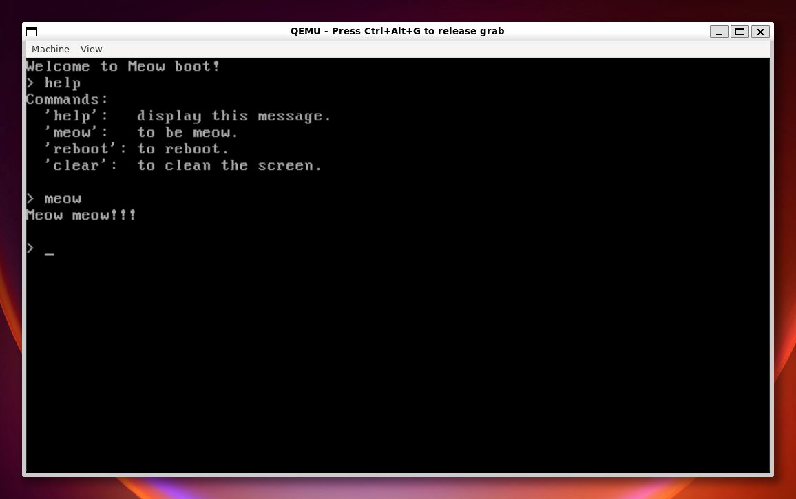

# Meow bootloader

> Learning how to program in assembly and make bootloader at the same time.



## Build dependencies

- GNU/Make
- NASM
- Qemu

```bash
make all
```

## Running

```bash
make run
```

OR

```
qemu-system-x86_64 ./build/boot_floppy.img
```
